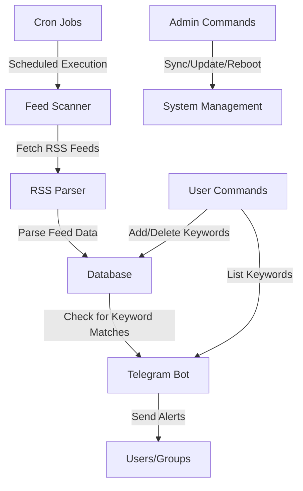

# News Alert Bot

A TypeScript Node.js application that monitors RSS feeds from various news sources and YouTube channels, and sends alerts to Telegram users when new content matching their keywords is published.

## Architecture

## Key Components

### 1. Database (database.ts)
- Uses SQLite with Sequelize ORM
- Two main models:
  - `Article`: Stores article titles and links
  - `Keyword`: Stores user-defined keywords with associated chat IDs

### 2. Feed Fetching (fetchFeeds.ts)
- Scans RSS feeds from news websites and YouTube channels
- Supports two methods for fetching feeds (toggleable):
  - Direct fetch using node-fetch
  - Using rss-parser library
- Processes feed items and checks for keyword matches
- Provides functions for keyword management (add, list, delete)

### 3. Telegram Bot (tgBot.ts)
- User interface for interacting with the system
- Command handlers:
  - `/add` - Add keywords to monitor
  - `/delete` - Remove keywords
  - `/list` - List all keywords for the current chat
  - Admin-only commands:
    - `/deleteAllArticles` - Clear article database
    - `/toggle` - Toggle feed fetching method
    - `/run` - Manually trigger feed scanning
    - `/sync` - Update from GitHub and restart

### 4. Synchronization (sync.ts)
- Provides functions for updating the application:
  - Git operations (pull, add, commit, push)
  - Build process
  - Application restart via PM2

### 5. Main Application (app.ts)
- Configures and initializes the database
- Sets up cron jobs for scheduled feed scanning:
  - News feeds: Every 12 minutes
  - YouTube feeds: At minutes 17, 38, and 56 of each hour

## Features

1. **Keyword-Based Alerts**: Users can subscribe to specific keywords and receive alerts when those keywords appear in news articles or YouTube videos.

2. **Multi-Source Monitoring**: Monitors multiple news sources and YouTube channels from a single system.

3. **Group Support**: Works with Telegram groups, allowing teams to receive alerts based on shared keywords.

4. **Access Control**: Restricts bot usage to specific allowed chat IDs.

5. **Admin Management**: Special commands for administrators to manage the system.

6. **Automated Updates**: Can pull updates from GitHub, rebuild, and restart itself.

7. **Scheduled Scanning**: Uses cron jobs to periodically scan feeds at configurable intervals.

8. **Error Handling**: Reports errors to admin group for monitoring.

## News Sources

The application monitors:
- 14 news websites (primarily from Suriname and Netherlands)
- 28 YouTube channels (including local TV stations, international news, and government channels)

## Deployment

The application appears to be deployed using PM2 process manager, which allows for easy restarts and management.